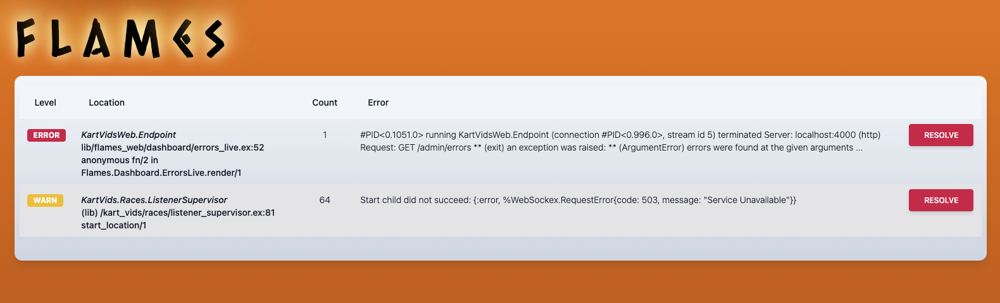

# Flames [](https://hex.pm/packages/flames) [](https://semaphoreci.com/mgwidmann/flames)



## Installation

The package can be installed as:

  1. Add `flames` to your list of dependencies in `mix.exs`:

```elixir
def deps do
  [{:flames, "~> 0.2.0"}]
end
```

  2. Ensure `flames` is started before your application:

```elixir
def application do
  [applications: [:flames]]
end
```

  3. Add configuration to tell `flames` what your repository and (optional) Phoenix Endpoint modules are as well as adding it as a Logger backend:

```elixir
config :flames,
  repo: MyPhoenixApp.Repo,
  endpoint: MyPhoenixApp.Endpoint,
  table: "errors" # Optional, defaults to "errors"

config :logger,
  backends: [:console, Flames.Logger]
```

  4. Add the following migration:

```elixir
defmodule MyApp.Repo.Migrations.CreateFlamesTable do
  use Ecto.Migration

  def change do
    # Make sure this table name matches the above configuration
    create table(:errors) do
      add :message, :text
      add :level, :string
      add :timestamp, :datetime # or :utc_datetime if you're using the latest ecto
      add :alive, :boolean
      add :module, :string
      add :function, :string
      add :file, :string
      add :line, :integer
      add :count, :integer
      add :hash, :string

      add :incidents, :json

      timestamps
    end

    create index(:errors, [:hash])
    create index(:errors, [:updated_at])
  end
end
```

  5. (Optional) Add it to your Phoenix Router and Phoenix Endpoint for live updates:

  Router (You should place this under a secure pipeline and secure it yourself)
```elixir
forward "/errors", Flames.Web
```

  Endpoint (Make sure this is the full path, adding `/socket` to the end)
```elixir
socket "/errors/socket", Flames.UserSocket
```


  Visit http://localhost:4000/errors (or wherever you mounted it) to see a live stream of errors.
